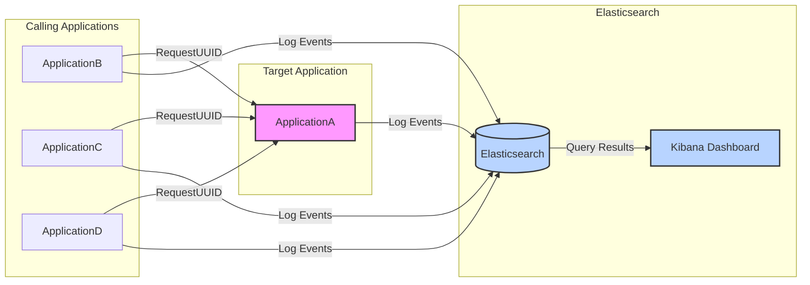
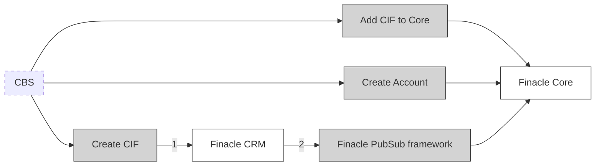
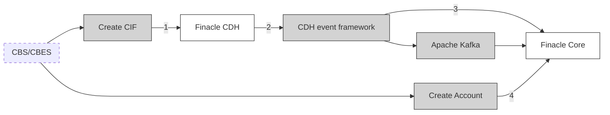
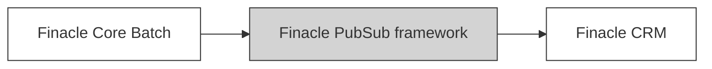
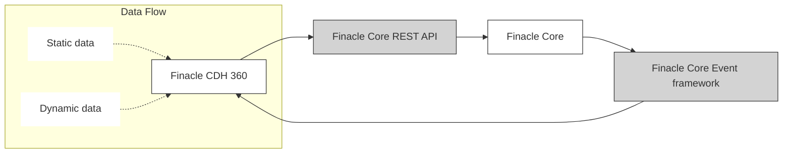

# Kibana Query to Find Calling Applications

This document contains an Elasticsearch DSL query to find all applications that are calling applicationA using RequestUUID correlation.

## System Architecture Diagram



## Query Purpose
The query is designed to:
1. Find all applications that are calling applicationA
2. Use RequestUUID correlation to track the request flow
3. Exclude applicationA from the results to show only the calling applications

## Elasticsearch DSL Query

```json
{
  "query": {
    "bool": {
      "must": [
        {
          "match": {
            "REQUESTTYPE": "operation1"
          }
        }
      ],
      "must_not": [
        {
          "match": {
            "cls.application": "applicationA"
          }
        }
      ],
      "filter": {
        "terms": {
          "RequestUUID": {
            "index": "your_index_name",
            "id": "your_index_name",
            "path": "RequestUUID",
            "query": {
              "bool": {
                "must": [
                  {
                    "match": {
                      "cls.application": "applicationA"
                    }
                  },
                  {
                    "match": {
                      "REQUESTTYPE": "operation1"
                    }
                  }
                ]
              }
            }
          }
        }
      }
    }
  },
  "aggs": {
    "calling_applications": {
      "terms": {
        "field": "cls.application",
        "size": 10000
      },
      "aggs": {
        "request_uuids": {
          "terms": {
            "field": "RequestUUID",
            "size": 10000
          }
        }
      }
    }
  },
  "size": 0
}
```

## Query Explanation

### Query Components:
1. **Main Query**:
   - Matches documents with REQUESTTYPE "operation1"
   - Excludes documents from applicationA
   - Filters for RequestUUIDs that are also used by applicationA

2. **Aggregations**:
   - Groups results by calling applications
   - For each calling application, shows the RequestUUIDs used
   - Sets size limits to 10000 to ensure comprehensive results

### Expected Output Structure:
```json
{
  "aggregations": {
    "calling_applications": {
      "buckets": [
        {
          "key": "applicationB",
          "doc_count": 5,
          "request_uuids": {
            "buckets": [
              {
                "key": "uuid1",
                "doc_count": 3
              }
            ]
          }
        }
      ]
    }
  }
}
```

## Usage Instructions
1. Replace "your_index_name" with your actual Elasticsearch index name
2. Adjust the size parameters if needed based on your data volume
3. Modify REQUESTTYPE "operation1" if looking for different operation types

## Notes
- The query excludes applicationA from the results to show only calling applications
- Results are grouped by calling application for better visibility
- Each calling application shows its associated RequestUUIDs and request counts

# Process Flow Diagrams

## As Is Process



## To Be Process



## Process Flow Comparison

### As Is Process Flow:
1. CBS initiates three parallel processes:
   - Create CIF → Finacle CRM
   - Add CIF to Core → Finacle Core
   - Create Account → Finacle Core
2. Finacle CRM communicates with Finacle Core through PubSub framework

### To Be Process Flow:
1. CBS/CBES initiates two processes:
   - Create CIF → Finacle CDH → CDH event framework → Finacle Core
   - Create Account → Finacle Core
2. Apache Kafka is integrated for event streaming
3. CDH event framework manages the event flow to Finacle Core

Key differences:
- Replacement of Finacle CRM with Finacle CDH
- Introduction of CDH event framework
- Integration of Apache Kafka for event streaming
- Simplified account creation process

## Batch Process Architecture (As Is)



## Event-Based Architecture (To Be)



## Architecture Comparison

### Batch Process Architecture (As Is):
1. Sequential processing flow:
   - Finacle Core Batch initiates the process
   - Data flows through PubSub framework
   - Finacle CRM receives the processed data
2. Synchronous batch-oriented approach
3. Limited real-time capabilities

### Event-Based Architecture (To Be):
1. Event-driven processing:
   - Finacle Core generates events in real-time
   - Events processed through Core Event framework
   - Finacle CDH 360 handles both static and dynamic data
2. Bidirectional flow through REST API
3. Separation of static and dynamic data handling

Key Improvements:
- Transition from batch to real-time processing
- Introduction of event-driven architecture
- Enhanced data handling with CDH 360
- REST API integration for dynamic interactions
- Better separation of concerns between static and dynamic data
- Improved scalability and responsiveness
